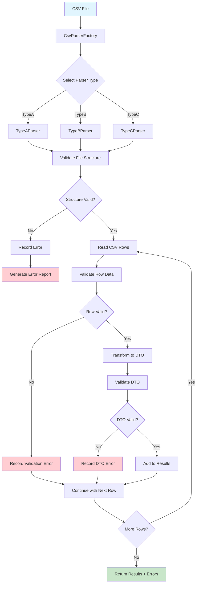

# Hastee CSV Parser Solution

## Overview

This solution implements a flexible and extensible CSV parser using the **Factory Pattern** with dependency injection of interfaces. The design allows for parsing different CSV file formats while maintaining a common output structure.

## 🚀 Quick Start

### Prerequisites
- .NET 9.0 SDK or later
- Windows, macOS, or Linux

### Running the Solution

#### Building the Project
```bash
dotnet build
```

#### Running the Demo
```bash
dotnet run --project CsvParser
```

The demo will:
- Parse sample CSV files using different parser types
- Demonstrate error handling with invalid data
- Show error reports and summaries

#### Running Tests
```bash
dotnet test
```

Tests are organized to mirror the main project structure and follow the naming convention:
- `Given{MethodName}_When{Condition}_Then{ExpectedResult}`

#### Additional Test Commands
```bash
# Run tests with verbose output
dotnet test --verbosity normal

# Run tests with coverage (if coverage tool is installed)
dotnet test --collect:"XPlat Code Coverage"

# Run specific test class
dotnet test --filter "FullyQualifiedName~CustomerDtoTests"

# Run tests in parallel
dotnet test --maxcpucount:0
```

## ✨ Features

### ✅ Flexible and Extensible Design
- Easy to add new parser types by implementing `BaseCsvParser`
- Reusable validation, transformation, and error handling components
- Factory pattern allows dynamic parser selection

### ✅ Clean, Well-Structured Code
- Clear separation of concerns with interfaces
- Comprehensive error handling and reporting
- Well-documented code with XML comments
- Organized folder structure mirroring architectural layers

### ✅ Robust Error Handling
- Detailed error tracking with row/column information
- Error categorization (Validation, Parsing, Transformation, Exception)
- Comprehensive error reporting and summary

### ✅ Data Validation
- Single-cell validation for individual fields
- Multi-cell validation for related fields
- DTO-level validation after transformation

### ✅ Data Transformation
- Flexible mapping from different CSV formats to common DTO
- Support for external data enrichment (API calls, database queries)
- Priority logic for email fields (corporate vs personal)

### ✅ Comprehensive Testing
- Unit tests organized to mirror main project structure
- Test naming convention: `Given{MethodName}_When{Condition}_Then{ExpectedResult}`
- Full coverage of core components and edge cases

## 🎯 Key Design Decisions

### 1. Interface-Based Design
- **Why**: Enables easy testing, mocking, and swapping implementations
- **Benefit**: Loose coupling between components

### 2. Factory Pattern
- **Why**: Centralized parser creation with type safety
- **Benefit**: Easy to extend with new parser types

### 3. Abstract Base Class
- **Why**: Common parsing logic shared across all parsers
- **Benefit**: Reduces code duplication and ensures consistent behavior

### 4. Comprehensive Error Handling
- **Why**: Detailed error tracking is crucial for data processing
- **Benefit**: Helps identify and fix data quality issues

### 5. Async Support
- **Why**: External data enrichment may require API calls
- **Benefit**: Non-blocking operations for better performance

### 6. Organized Folder Structure
- **Why**: Clear separation between interfaces, implementations, models, and factories
- **Benefit**: Easy navigation and maintenance, consistent with architectural patterns

### 7. Shared Constants
- **Why**: Centralized configuration and elimination of magic strings
- **Benefit**: Maintainable code with consistent naming and values

## 🎉 Benefits of This Design

1. **Maintainability**: Clear separation of concerns and organized folder structure
2. **Testability**: Interface-based design enables easy unit testing
3. **Extensibility**: Easy to add new parser types and validation rules
4. **Reusability**: Components can be reused across different parser types
5. **Error Handling**: Comprehensive error tracking and reporting
6. **Flexibility**: Supports various CSV formats with different field structures
7. **Code Quality**: Modern C# features, consistent naming, and organized structure

### ✅ Flexible and Extensible Design
- Easy to add new parser types by implementing `BaseCsvParser`
- Reusable validation, transformation, and error handling components
- Factory pattern allows dynamic parser selection

### ✅ Clean, Well-Structured Code
- Clear separation of concerns with interfaces
- Comprehensive error handling and reporting
- Well-documented code with XML comments
- Organized folder structure mirroring architectural layers

### ✅ Robust Error Handling
- Detailed error tracking with row/column information
- Error categorization (Validation, Parsing, Transformation, Exception)
- Comprehensive error reporting and summary

### ✅ Data Validation
- Single-cell validation for individual fields
- Multi-cell validation for related fields
- DTO-level validation after transformation

### ✅ Data Transformation
- Flexible mapping from different CSV formats to common DTO
- Support for external data enrichment (API calls, database queries)
- Priority logic for email fields (corporate vs personal)

### ✅ Comprehensive Testing
- Unit tests organized to mirror main project structure
- Test naming convention: `Given{MethodName}_When{Condition}_Then{ExpectedResult}`
- Full coverage of core components and edge cases

## 📁 Project Structure

### Main Project (`CsvParser/`)

```
CsvParser/
├── Models/
│   └── CustomerDto.cs
├── Validation/
│   ├── Interfaces/
│   │   └── IValidator.cs
│   ├── Models/
│   │   └── ValidationResult.cs
│   └── Implementations/
│       └── CustomerValidator.cs
├── Transformation/
│   ├── Interfaces/
│   │   └── ITransformer.cs
│   └── Implementations/
│       └── CustomerTransformer.cs
├── ErrorHandling/
│   ├── Interfaces/
│   │   └── IErrorHandler.cs
│   ├── Models/
│   │   ├── ParsingError.cs
│   │   └── ErrorType.cs
│   └── Implementations/
│       └── CsvErrorHandler.cs
├── Parsing/
│   ├── Interfaces/
│   │   └── ICsvParser.cs
│   ├── Factories/
│   │   └── CsvParserFactory.cs
│   └── Implementations/
│       ├── BaseCsvParser.cs
│       ├── TypeAParser.cs
│       ├── TypeBParser.cs
│       └── TypeCParser.cs
├── Shared/
│   └── Constants/
│       ├── FieldNames.cs
│       ├── ValidationConstants.cs
│       ├── ErrorMessages.cs
│       ├── ParserTypes.cs
│       └── ...
└── Program.cs
```

### Test Project (`Tests/CsvParser.UnitTests/`)

```
Tests/CsvParser.UnitTests/
├── Models/
│   └── CustomerDtoTests.cs
├── Validation/
│   └── Models/
│       └── ValidationResultTests.cs
├── ErrorHandling/
│   ├── Models/
│   │   └── ParsingErrorTests.cs
│   └── Implementations/
│       └── CsvErrorHandlerTests.cs
└── Parsing/
    └── Factories/
        └── CsvParserFactoryTests.cs
```

## 🔄 Basic Parsing Flow



## 🏗️ Architecture

### Design Patterns Used

1. **Factory Pattern**: `CsvParserFactory` creates different parser types based on the provided parser type string
2. **Strategy Pattern**: Different parser implementations handle various CSV formats
3. **Dependency Injection**: Interfaces are injected into parsers for validation, transformation, and error handling

### Core Components

#### Models
- **`CustomerDto`**: Common Data Transfer Object for customer data
- **`ValidationResult`**: Result of validation operations
- **`ParsingError`**: Detailed error information with location and context
- **`ErrorType`**: Enumeration of error categories (Validation, Parsing, Transformation, Exception)

#### Interfaces
- **`IValidator`**: Handles data validation (single-cell and multi-cell)
- **`ITransformer`**: Transforms raw CSV data into common DTO format
- **`IErrorHandler`**: Records and manages parsing errors
- **`ICsvParser`**: Base interface for all CSV parsers

#### Parsers
- **`BaseCsvParser`**: Abstract base class with common parsing logic
- **`TypeAParser`**: Handles CSV format: `CustomerID, Full Name, Email, Phone, Salary`
- **`TypeBParser`**: Handles CSV format: `ID, Name, Surname, CorporateEmail, PersonalEmail, Salary`
- **`TypeCParser`**: Handles CSV format: `EmployeeID, FirstName, LastName, WorkEmail, MobileNumber, AnnualSalary, Department`

#### Implementations
- **`CustomerValidator`**: Concrete validation implementation
- **`CustomerTransformer`**: Concrete transformation implementation
- **`CsvErrorHandler`**: Concrete error handling implementation

#### Factory
- **`CsvParserFactory`**: Creates parser instances based on type

#### Shared Constants
- **`FieldNames`**: Centralized field name constants organized by category
- **`ValidationConstants`**: Validation rules and constraints
- **`ErrorMessages`**: Standardized error messages
- **`ParserTypes`**: Supported parser type constants

## 💻 Usage Example

```csharp
// Create dependencies
IValidator validator = new CustomerValidator();
ITransformer transformer = new CustomerTransformer();
IErrorHandler errorHandler = new CsvErrorHandler();

// Create factory
var factory = new CsvParserFactory();

// Create parser for specific type
var parser = factory.CreateParser("TypeA", validator, transformer, errorHandler);

// Parse CSV file
var customers = await parser.ParseAsync("path/to/file.csv");

// Check for errors
if (errorHandler.HasErrors())
{
    var errorReport = errorHandler.ExportErrorReport();
    Console.WriteLine(errorReport);
}
```

## 📄 Supported CSV Formats

### TypeA Format
```
CustomerID, Full Name, Email, Phone, Salary
CUST001, John Doe, john.doe@email.com, +1234567890, 75000
```

### TypeB Format
```
ID, Name, Surname, CorporateEmail, PersonalEmail, Salary
EMP001, Alice, Brown, alice.brown@company.com, alice.personal@email.com, 90000
```

### TypeC Format
```
EmployeeID, FirstName, LastName, WorkEmail, MobileNumber, AnnualSalary, Department
E001, Frank, Miller, frank.miller@work.com, +1234567893, 95000, Engineering
```

## 🔧 Extending the Solution

### Adding a New Parser Type

1. Create a new parser class inheriting from `BaseCsvParser`:
```csharp
public class NewTypeParser : BaseCsvParser
{
    public NewTypeParser(IValidator validator, ITransformer transformer, IErrorHandler errorHandler) 
        : base(validator, transformer, errorHandler) { }
    
    public override string GetParserType() => "NewType";
    
    public override async Task<bool> ValidateFileStructureAsync(string filePath)
    {
        // Implement structure validation
    }
}
```

2. Register the new parser in the factory:
```csharp
factory.RegisterParserType("NewType", (v, t, e) => new NewTypeParser(v, t, e));
```

### Adding Custom Validation Rules

Extend `CustomerValidator` or create a new validator implementing `IValidator`:
```csharp
public class CustomValidator : IValidator
{
    // Implement validation methods
}
```

### Adding Custom Transformations

Extend `CustomerTransformer` or create a new transformer implementing `ITransformer`:
```csharp
public class CustomTransformer : ITransformer
{
    // Implement transformation methods
}
```

## 🧪 Testing

### Testing Strategy

The solution follows a comprehensive testing approach with unit tests organized to mirror the main project structure. All tests use xUnit framework and follow the **Given-When-Then** naming convention for clarity and maintainability.

### Test Structure

Tests are organized in the `Tests/CsvParser.UnitTests/` project with the following structure:

```
Tests/CsvParser.UnitTests/
├── Models/
│   └── CustomerDtoTests.cs          # Tests for CustomerDto properties and behavior
├── Validation/
│   └── Models/
│       └── ValidationResultTests.cs # Tests for validation result creation and properties
├── ErrorHandling/
│   ├── Models/
│   │   └── ParsingErrorTests.cs     # Tests for error model creation and properties
│   └── Implementations/
│       └── CsvErrorHandlerTests.cs  # Tests for error handling functionality
└── Parsing/
    └── Factories/
        └── CsvParserFactoryTests.cs # Tests for factory pattern implementation
```

### Test Naming Convention

All tests follow the **Given-When-Then** pattern for clear test intent:

```csharp
[Fact]
public void Given_CreateCustomerDto_When_ValidDataProvided_Then_PropertiesSetCorrectly()
{
    // Arrange
    var customerId = "CUST001";
    var fullName = "John Doe";
    var email = "john.doe@email.com";
    var phone = "+1234567890";
    var salary = 75000m;

    // Act
    var customer = new CustomerDto(customerId, fullName, email, phone, salary);

    // Assert
    Assert.Equal(customerId, customer.CustomerId);
    Assert.Equal(fullName, customer.FullName);
    Assert.Equal(email, customer.Email);
    Assert.Equal(phone, customer.Phone);
    Assert.Equal(salary, customer.Salary);
}
```

### Test Categories

#### 1. Model Tests
- **Purpose**: Verify data models behave correctly
- **Coverage**: Property assignment, validation, immutability
- **Examples**: `CustomerDtoTests`, `ValidationResultTests`, `ParsingErrorTests`

#### 2. Implementation Tests
- **Purpose**: Test concrete implementations of interfaces
- **Coverage**: Business logic, error handling, edge cases
- **Examples**: `CsvErrorHandlerTests`

#### 3. Factory Tests
- **Purpose**: Verify factory pattern creates correct instances
- **Coverage**: Parser creation, type validation, error scenarios
- **Examples**: `CsvParserFactoryTests`

### Test Examples

#### CustomerDto Tests
```csharp
[Fact]
public void Given_CreateCustomerDto_When_NullValuesProvided_Then_PropertiesSetToNull()
{
    // Arrange & Act
    var customer = new CustomerDto(null, null, null, null, null);

    // Assert
    Assert.Null(customer.CustomerId);
    Assert.Null(customer.FullName);
    Assert.Null(customer.Email);
    Assert.Null(customer.Phone);
    Assert.Null(customer.Salary);
}
```

#### ValidationResult Tests
```csharp
[Fact]
public void Given_CreateValidationResult_When_ValidData_Then_IsValidTrue()
{
    // Arrange & Act
    var result = new ValidationResult(true, "Success");

    // Assert
    Assert.True(result.IsValid);
    Assert.Equal("Success", result.Message);
}
```

#### Error Handling Tests
```csharp
[Fact]
public void Given_AddError_When_ValidError_Then_ErrorAddedToCollection()
{
    // Arrange
    var errorHandler = new CsvErrorHandler();
    var error = new ParsingError(ErrorType.Validation, "Invalid email", 1, 2);

    // Act
    errorHandler.AddError(error);

    // Assert
    Assert.True(errorHandler.HasErrors());
    Assert.Single(errorHandler.GetErrors());
}
```

### Test Best Practices

1. **Arrange-Act-Assert**: Clear separation of test phases
2. **Descriptive Names**: Test names explain the scenario being tested
3. **Single Responsibility**: Each test verifies one specific behavior
4. **Edge Cases**: Tests include null values, empty strings, and boundary conditions
5. **Mocking Ready**: Interface-based design enables easy mocking for integration tests

### Future Test Enhancements

- **Integration Tests**: Test complete parsing workflows
- **Performance Tests**: Benchmark parsing performance with large files
- **Property-Based Tests**: Use FsCheck for property-based testing
- **Mutation Testing**: Verify test quality with mutation testing

## 🎉 Benefits of This Design

1. **Maintainability**: Clear separation of concerns and organized folder structure
2. **Testability**: Interface-based design enables easy unit testing
3. **Extensibility**: Easy to add new parser types and validation rules
4. **Reusability**: Components can be reused across different parser types
5. **Error Handling**: Comprehensive error tracking and reporting
6. **Flexibility**: Supports various CSV formats with different field structures
7. **Code Quality**: Modern C# features, consistent naming, and organized structure